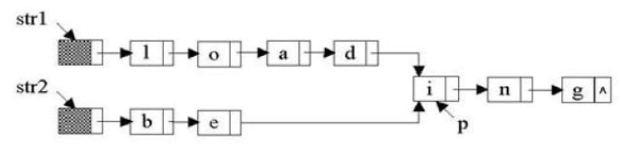
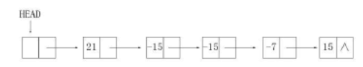
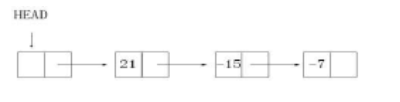

2021考研的第二章！！！冲冲冲

[Toc]
# 第二章  线性表
【考纲的内容】
	（一）线性表的定义和基本操作
	（二）线性表的实现
	（三）顺序存储：链式存储；线性表的应用
【知识框架】

​	

## 2.1 线性表的定义和基本操作
### 2.1.1  线性表的定义
		线性表是具有相同数据类型的n(你>=0)个数据元素的有限序列，其中n为表长，当n=0时，线性表是一个空表。若用L命名线性表，则其一般表示表示为：
			L=(a1,a2,...,ai,a(i+1),...,an)
		式中，a1是唯一的“第一个”数据元素，又称表头元素；an是唯一的“最后一个”数据元素，又称表尾元素。除第一个元素以外，每个元素有且仅有一个直接前驱。除最后一个元素以外，每个元素有且仅有一个直接后驱。根据上述的定义中我们可以得出线性表的如下特点：
	    1.表中元素的个数有限
	    2.表中元素具有逻辑上的顺序性，表中元素有其先后次序
	    3.表中元素都是数据元素，每个元素都是单个元素
	    4.表中元素的数据类型都相同，这意味着每个元素占有相同大小的存储空间
	    5.表中元素具有抽象性，即仅讨论元素间的逻辑关系，而不考虑元素究竟表示什么内容
		注意：线性表是一种逻辑结构，表示元素之间一对一的相邻关系。顺序表和链表是指存储结构，两者属于不同层面的概念，因此不要将其混淆。

### 2.1.2  线性表的基本操作
		一个数据结构的基本操作是指其最核心，最基本的操作。其他较复杂的操作可通过调用其基本操作来实现。线性表的主要操作如下：
		InitList(&L):初始化表。构建一个空的线性表
		Length(L):求表长。返回线性表L的长度，即L中数据元素的个数
		LocateElem(L,e):按值查找操作。在表L中查找具有给定关键字值的元素
		GetElem(L,i):按位查找操作。获取表L中第i个位置的元素的值
		ListInsert(&L,i,e):插入操作。在表L中的第i个位置上插入指定元素e
		ListDelete(&L,i,&e):删除操作。输出表L中第i个位置的元素,并用e返回删除的元素
		PrintList(L):输出操作。按前后顺序输出线性表L的所有元素值
		Empty(L):判空操作。若L为空表，则返回true，否则返回false
		DestroyList(&L):销毁操作。毁掉线性表，并释放线性表L所占用的内存空间
## 2.2  线性表的顺序表示

### 2.2.1  顺序表的定义
		线性表的顺序存储又称顺序表。它是用一组地址连续的存储单元依次存储子线性表中的数据元素，从而使得逻辑上相邻的两个元素在物理位置上也相邻。第一个元素存储在线性表的起始位置，第i个元素的存储位置后面紧接着存储的是第i+1个元素，称i为元素ai在线性表中的位序。因为，顺序表的特点是表中元素的逻辑顺与其物理顺序相同。
		假设线性表L存储的起始位置为LOC(A),sizeof(ElemType)是每个数据元素所占用存储空间的大小，则表L所对应的顺序如下图所示：


	==注意:==线性表中的元素的位序是从一开始的，而数组中元素的下标谁从0开始的
		
假定线性表的元素类型为ElemType，则线性表的顺序存储类型描述为：

```c++
	#define MaxSize 50   //定义线性表的最大长度
	typedef struct{		
		ElemType data[MaxSize];  //顺序表的元素
		int length;				//顺序表的长度
	}SqList;					//顺序表的类型定义
```
		在上面的写法中是静态分配的，当然一堆数组也可以动态的进行分配。在静态分配时会产生一些问题，由于数组的大小和空间已经固定。一旦空间占满，再加入新的元素就会产生移溢出，进而导致程序崩溃。
		在动态分配中，存储数组的空间是在程序执行过程中通过动态分配语句分配的，一旦数据空间占满，就会另外的申请更大的空间。从而达到扩充空间的目的，而不需要为线性表一次性地划分所有空间。
```c++
	#define InitSize 100   //表长度的初始定义
	typedef struct{		
		ElemType *data;  		//指针动态分配数组的指针
		int MaxSize,length;		//数组的最大容量和当前个数
	}SqList;					//动态分配数组顺序表的定义类型
```
	C语言的动态分配语句为：
	L.data=(ElemType *)malloc(sizeof(ElemType) *InitSize);
	C++的初始动态分配语句为：
	L.data=new ElemType[InitSize];

==注意:==动态分配并不是链式存储，他同样属于顺序存储结构，物理结构没有变化，依然是随机存取方式，只是分配的空间大小可以在运行时决定。

	下面是总结下顺序结构的特点：
	1.顺序结构最主要的特点是随机访问，及通过首地址和元素序号可在时间O(1)内找到指定的元素。
	2.顺序表的存储密度高，每个节点只存储数据元素
	3.顺序表逻辑上相邻的元素物理上也相邻，所以插入和删除操作需要移动大量元素
### 2.2.2  顺序表上基本操作的实现
	接下来分别给出插入、删除以及按值查找的算法
(1) 插入操作
		在顺序表L的第i(1<=i<=L.length+1)个位置插入新元素额。若i的输入不合法，则返回false，表示插入失败；否则，将顺序表的第i个元素及后面的所有元素右移一个位置，腾出一个空位置插入新元素e,顺序表的长度+1，插入成功，返回true
```c++
	bool ListInsert(SqList &L,int i,ELemType e){
	  	if(i<1||i>L.length+1){   //判断i的范围是否有效
	  		return false; 
	  	}
	  	if(L.length>=MaSize){	 //判断存储空间是否已满
	  		return false; 
	  	}
	  	for(int j=L.length;j>=i;j--){	//将的第i个元素及以后的元素后移
	  		L.data[j]=L.data[j-1];
	  	}
	  	L.data[i-1]=e;	//在位置i出放入e
	  	L.length++;		//线性表长度+1
	  	return true;	  	
	}
```
==注意:==区别顺序表的位序和数组的下标。为何判断插入位置是否合法时if 语句中用length+1，而在移动元素的for语句中只用length？
答案：因为插入可以插入到顺序表的末尾，而整个顺序表中有length个元素，查到最后就是插入第length+1个位置，而在移动元素时，是判断的下标就不是第几个位置了，最后一个元素的下标就是length-1，将最后一个元素后移就是移动到下表为length的位置。大家理解了没？欢迎评论哦！

	下面我们来分析下进行插入操作时的最好情况、最坏情况以及平均情况。
	最好情况：在表尾插入,即i=length+1,元素后移语句将不执行，时间复杂度为O(1)。
	最坏情况：在表头插入,即i=1,元素后移语句执行length次，时间复杂度为O(n)。
	平均情况：假设pi(pi=1/(n+1))是在第i个位置上插入一个节点的概率，则在长度为n的线性表中插入一个节点时，所需移动节点的平均次数为：


因此，线性表插入算法的平均复杂度为O(n).

(2) 删除操作
		删除顺序表中第i(1<=i<=L.length) 个位置的元素,若成功则返回true,并将被删除的元素用引用变量e返回,否则返回false。

```c++
	bool ListInsert(SqList &L,int i,ELemType &e){
	  	if(i<1||i>L.length){   //判断i的范围是否有效
	  		return false; 
	  	}
	  	e=L.data[i-1];			//将被删除的元素赋值给e
	  	for(int j=i;j<L.length;j++){	//将的第i个元素后的元素前移
	  		L.data[j-1]=L.data[j];
	  	}
	  	L.length11;		//线性表长度-1
	  	return true;	  	
```

	下面我们来分析下进行删除操作时的最好情况、最坏情况以及平均情况。
	最好情况：删除表尾元素(即i=n),无需移动元素,时间复杂度为O(1)。
	最坏情况：删除表头元素(即i=1),需移动第一个元素以外的所有元素,时间复杂度为O(n)。
	平均情况：假设pi(pi=1/n)是删除第i个位置上节点的概率，则在长度为n的线性表中删除一个节点时,
	所需移动节点的平均次数为：


因此，线性表删除算法的平均时间复杂度为O(n)。

		下图为一个顺序表进行插入和删除操作前后的状态，以及其数据元素在存储空间中的位置变化和表长的变化。在a图中，将第4个至第7个元素从后往前依次后移一个位置，在b图中，将第5个至第7个元素依次前移一个位置。


(3) 按值查找(顺序查找)
在顺序表L中查找第一个元素等于e的元素,并返回其位序。
```c++
	int LocateElem(SqList L,ElemType e){
		int i;
		for(i=0;i<L.length;i++){
			if(L.data[i]==e){
				return i+1;
			}
		}
		return 0;
	}
```

	下面我们来分析下进行按值查找操作时的最好情况、最坏情况以及平均情况。
	最好情况：查找的元素就在表头,仅需比较一次,时间复杂度为O(1)。
	最坏情况：查找的元素在表尾或者不存在,需要比较n次,时间复杂度为O(n)。
	平均情况：假设pi(pi=1/n)是查找的元素在第i(i<=i<=L.length)个位置上的概率，则在长度为n的线性表中查找值为e的元素所需要比较的平均次数为：


因此，线性表按值查找算法的平均时间复杂度为O(n).

### 2.2.3  本节习题(选择题我列举几题，综合应用题会全部写出来)
```c
一、单项选择题
1.下列(A)是顺序结构的优点。
A.存储密度大          B.插入运算方便
C.删除运算方便         D.方便地运用于各种逻辑结构的存储表示
解析：B和C大家应该都明白吧，至于D选项比如树形结构就不适用于用顺序结构表示更加的适合用链式结构表示。

2.线性表的顺序结构是一种(A)。
A.随机存取的存储结构				B.顺序存取的存储结构
C.索引存取的存储结构				D.元素中各字段的类型
解析：存取是指读写的方式，我们在顺序表的使用过程中显然可以存取任意位置的元素，很多会误选B。

3.若线性表最常用的操作是存取第i个元素以及其前驱和后继元素的值，为了提高效率，应采用(D)的存储方式。
A.单链表                            		    B.双向连表
C.但循环列表								D.顺序表
解析：A.B.C三个选项都只能从头结点依次寻找，时间复杂度为O(n),顺序表可以通过下标直接访问。

4.设线性表有n个元素，严格来说，以下操作中，(C)在顺序表上实现要比链表上实现的效率高。
Ⅰ.输出第i(1<=i<=n)个元素值
Ⅱ.交换第3个元素与第4个元素的值
Ⅲ.顺序输出这n个元素的值
A.Ⅰ    B.Ⅰ、Ⅲ     C.Ⅰ、Ⅱ    D.Ⅱ、Ⅲ
解析：输出第i个元素顺序表可以直接通过下标访问进行输出，对于Ⅱ交换元素这一操作，在链表中要分别找到前驱节点，然后还要进行断链，再次连接起来，而顺序表可以直接进行交换。对于Ⅲ的顺序输出而言，都是一次访问所有的元素，并没有很大的区别。

二、综合应用题
1.从顺序表中删除具有最小值的元素(假设唯一)并且由函数返回被删元素的值。空出的位置有最后一个元素填补，若顺序表为空则显示出错误信息并退出运行。
算法思想：搜索整个顺序表,查找最小值元素并记住其位置，搜索结束后用最后一个元素填补出的原最小值的位置 。
代码如下：
bool Del_Min(spList &L,ElemType &value){
	//删除顺序表L中最小值元素结点,并通过引用型参数value返回其值
	//若删除成功,则返回true，否则返回false
	if(L.length==0){
		return 0;		//表空,中止操作返回
	}
	value=L.data[0];
	int pos=0;			// 假定0号元素的值最小
	for(int i=1;i<L.length;i++){//循环.寻找具有最小值的元素
		if(L.data[i]<value){	//让value记忆当前具有最小值的元素
			value=L.data[i];                                       
			pos=i;
		}
	}
	L.data[pos]=L.data[L.length-1];		//空出的位置由最后一个元素填补
	return true;						//此时,value的即为最小
}


2.设计一个高效算法，将顺序表L的所有元素逆置，要求算法的空间复杂度为O(1)
思想：扫描顺序表L的前半部分,对于元素L.data[i](o≤i<L.length/2),将其与后半部分的对应元素L.data[L.length-i-1]进行交换。
代码如下：       
	void Reverse(SqList &L){
		Elemtype temp;		//辅助变量
		for(i=0;i<L.length/2;i++){
			temp=L.data[i];		 //交换L.data[i]与L.data[L.length-i-1]
			L.data[i]=L.data[L.length-i-1];
			L.data[L.length-i-1]=temp;
		}
	}
	

3.对长度为n的顺序表L，编写一个时间复杂度为O(n)，空间复杂度为O(1)的算法，该算法删除线性表中所有值为x的数据元素
思想：用k记录顺序表L中不等于x的元素个数(即需要保存的元素个数),边扫描L边统计K，并将不等于x的元素向前移动k个位置,最后修改L的长度。 
代码如下：
	void del_x_l(Sqlist &L,Elemtype x){
		//本算法实现删除顺序表L中所有值为x的数据元素
		int k=0;		//记录值不等于x的元素个数
		for(i=0;i<L.length;i++){
			if( L.data[i]!=x){
				L.data[k]=L.data[i];
				k++;	//不等于x的元素增1
			}
		}
		L.length=k;    //顺序表L的长度等于k                                             
	} 
	

4.从有序顺序列表中删除其值在给定值s与t之间(要求s<t)的所有元素，如果s或t不合理或顺序表为空，则显示出错误并退出运行。
思想：先寻找出值大于等于s的第一个元素(第一个删除的元素),然后找到值待遇t的第一个元素(最后一个删除的元素的下一个元素),要将这段删除，只需直接将后面的元素前移。
代码如下：
	bool Del_s_t(Sqlist &L,Elemtype s,Elemtype t){
		//删除有序列表L中值在给定值s与t之间的所有元素
		int i,j;
		if(s≥t||L.length==0){
			return false；
		}  
		for(int i=0;i<L.length&&L.data[i]<s;i++)//寻找到大于等于s的第一个元素
		if(i>=L.length){
			return false;						//所有元素都小于s，返回
		}
		for(int j=i;j<L.length&&L.data[j]<t;j++)//寻找值大于t的第一个元素
		for(;j<L.length;i++;j++){
			L.data[i]=L.data[j];				//前移，填补被删元素位置
		}
		L.length=i;
		return true;
	}
	

5.从顺序表中删除其值在给定s与t之间(包含s和t,要求s<t)的所有元素，如果s或t不合理或顺序表为空，则显示出错误信息并退出运行
思想：从前向后扫描顺序表L,用k记录下元素值在s到t之间元素的个数(初始时k=0).对于当前扫描的元素，若其值不在s到t之间，则前移k个位置；否则执行k++;由于这样每个不在s到t之间的元素仅移动一次,所以算法效率高。
代码如下：
	bool Del_s_t(Sqlist &L,Elemtype s,Elemtype t){
		//删除顺序表L中值在给定值s与t之间(要求s<t)的所有元素
		int i,k=0;
		 if(L.length==0||s>=t){
		 	return false;		//线性表为空或s、t不合法,返回
		 }
		 for(i=0;i<L.length;i++){
		 	if(L.data[i] >=s&&L.data[i]<=t){
		 		k++;
		 	} else{
		 		L.data[i-k]=L.data[i];//当前元素前移k个位置
		 	}
		 }
		 L.length-=k;//长度减小
		 return true;
	}


6.从有序顺序表中删除所有其值重复的元素，使表中所有元素的值均不同。
思想：注意是有序顺序表，值相同的元素一定在连续的位置上，用类型于直接插入排序的思想，初始时将第一个元素视为非重复的有序表。之后依次判断后面的元素是否与前面非重复有序表的最后一个元素相同，若相同则继续向后判断，若不同则插入到前面的非重复有序表的最后，直至判断到表尾为止
代码如下：
	bool Delete_Same(SeqList &L){
		if(L.length==0){
			return false;
		}
		int i,j;						//i存储第一个不相同的元素，j为工作指针
		for(i=0,j=1;j<L.length;j++){
			if(L.data[i]!=L.data[j]){	//查找下一个与上个元素值不同的元素
				L.data[++i]=L.data[j];	//找到后,将元素前移
			}
		}
		L.length=i+1;
		return true;
	}
	

7.将两个有序顺序表合并为一个新的有序顺序表，并由函数返回结果顺序表
思想：首先，按顺序不断取下两个顺序表表头较小 的结点存入新的顺序表中。然后，看哪个表还有剩余，将剩余的部分加到新的顺序表后面。
代码如下：
	bool Merge(SeqList A,SeqList B,SeqList C){
		 //将有序顺序表A与B合并为一个新的有序顺序表C
		 if(A.length+B.length>C.length){		//大于顺序表的最大长度
		 	return false;
		 }
		 int i=0,j=0,k=0;
		 while(i<A.length&&j<B.length){		//循环，两两比较，小者存入结果表
		 	if(A.data[i]<=B.data[j]){
		 		C.data[k++]=A.data[i++];
		 	}else
		 		C.data[k++]=A.data[j++];
		 }
		 while(i<A.length){			//还剩一个没有比较完的顺序表
		 	C.data[k++]=A.data[i++];
		 }
		 while(j<B.length){
		 	C.data[k++]=B.data[j++];
		 } 
		 C.length=c;
		 return  true;
	}
	

8.已知在 一维数组A[m+n]中依次存放两个线性表(a1,a2...am)和(b1,b2...bn)。试编写一个函数，将数组中两个顺序表的位置互换，即将(b1,b2...bn)放在(a1,a2...am)的前面。
思想：先将数组A[m+n]中的全部元素(a1,a2,a3,...,am,b1,b2,b3,...bn)原地逆置(bn,bn-1,...b1,am,am-1,...a1),再对前n个元素和后m个元素分别使用逆置算法，即可得到(b1,b2,...,bn,a1,a2,a3,...am),从而实现顺序表的位置互换
代码如下：
	typedef int DataType;
	void Reverse(DataType A[],int left,int right,int arraySize){
		//逆转A[m+n]
		if(left>=right||right>=arraySize){
			return;
		}
		int mid=(right+left)/2;
		for(int i=0;i<=mid-left;i++){
			Datatype temp=A[left+i];
			A[left+i]=A[right-i];
			A[right-i]=temp;
		}
		void Exchange(DataType A[],int m,int n,int arraySize){
			Reverse(A,0,m+n+1,arraySize);
			Reverse(A,0,n-1,arraySize);
			Reverse(A,n,m+n+1,arraySize);
		}
	}

9.线性表(a1,a2,...an)中的元素递增有序且按顺序存储于计算机内,要求设计一算法,完成用最少时间在表中查找数值为x的元素,若找到则将其与后继元素位置相交换,若找不到则将其插入表中并使表中元素任递增有序。
思想：顺序存储的线性表递增有序，可以顺序查找，也可以折半查找。
代码如下：
	void SearchExchangeInsert(ElemType A[],ElemType x){
		int low=0,high=n-1,mid;			//low和high指向顺序表下界和上界的下标
		while(low<=high){
			mid=(low+high)/2;			//找中间位置
			if(A[mid]==x)  break;		//找到x，退出while循环
			else if(A[mid]<x) low=mid+1;//到终点mid的右半部查找
			else high=mid-1;			//到终点mid的左半部查找
		}//下面两个if语句只会执行一个
		if(A[mid]==x&&mid!=n-1){		//若最后一个元素与x相等，则不存在与其后继交换的操作
			t=A[mid];A[mid]=A[mid+1] ;A[mid+1]=t;
		}
		if(low>high){				//查找失败，插入数据元素x
			for(i=n-1;i>high;i--){	
				A[i+1]=A[i];		//后移元素
			}
			A[i+1]=x;				//插入x
		}							
		
	}

10.【2010真题】将设n(n>1)个整数存放到一维数组R中。设计一个在时间和空间两方面都尽可能高效的算法。将R中保存的序列循环左移p(0<p<n)个位置，即将R中的数据由(X0,X1,...,Xn-1)变换为(Xp,Xp+1,...,Xn-1,X0,X1,...,Xp-1)。要求:
1)给出算法的基本设计思想
2)根据设计思想,采用c或c++或java语言描述算法，关键之处给出注释
3)说明你所设计算法的时间辅助度和空间复杂度
1.算法的基本设计思想：我们可以把这一整个数组看成2部分，即将数组AB转化为输组BA,在前面的题目中也有类似的题目，这一题我们先将A逆置，再将B逆置，最后将逆置后的整体逆置一次就可以得到我们想要的答案。设Reverse函数执行将数组元素逆置的操作，对abcdefgh向左循环移动3(p=3)个位置的过程如下：
Reverse(0,p-1)得到cbadefgh;
Reverse(p,n-1)得到cbahgfed;
Reverse(0,n-1)得到defghabc;
2.使用C语言描述算法如下：
	void Reverse(int R[],int from,int to){
		int i,temp;
		for(i=0;i<(to-from+1)/2;i++){
			temp=R[from+i];R[from+i]= R[to-i];R[to-i]=temp;
		}
	}
	void Converse(int R[],int n,int p){
		Reverse(0,p-1);
		Reverse(p,n-1);
		Reverse(0,n-1);
	}
3.上述算法中三个Reverse函数的时间复杂度分别为O(p/2)、O((n-p)/2)和O(n/2),故所涉及的算法的时间辅助度为O(n),空间辅助度为O(1)。

11.【2011真题】一个长度为L（L≥1）的升序序列S，处在第[L/2]个位置的数称为S的中位数。例如，若序列S1=（11，13，15，17，19），则S1的中位数是15，两个序列的中位数是含它们所有元素的升序序列的中位数。例如，若S2=（2，4，6，8，20），则S1和S2的中位数是11。现在有两个等长升序序列A和B，试设计一个在时间和空间两方面都尽可能高效的算法，找出两个序列A和B的中位数。要求：
(1)给出算法的基本设计思想。
(2)根据设计思想，采用C、C++或Java语言描述算法，关键之处给出注释。
(3)说明你所设计算法的时间复杂度和空间复杂度。
1.算法的基本设计思想如下：
分别求两个升序序列A、B的中位数，设为a和b，求序列A、B的中位数过程如下：
①若a=b,则a或b即为所求中位数，算法结束
②若a<b,则舍弃序列A中较小的一半，同时舍弃序列B中较大的一半，要求两次舍弃的长度相等。
③若a>b,则舍弃序列A中较大的一半,同时舍弃序列B中较小的一半，要求两次舍弃的长度相等。 
在保留的两个升序序列中，重复过程①、②、③，直到两个序列中均只含一个元素时为止，较小者即为所求的中位数。
2.本题代码如下：
	int M_Search(int A[],int B[],int n){
		int s1=0,d1=n-1,m1,s2=0,d2=n-1,m2;
		//分别表示序列A和B的首位数、末尾数和中位数。
		while(s1!=d1||s2!=d2){
			m1=(s1+d1)/2;
			m2=(s2+d2)/2;
			if(A[m1]==B[m2]){
				return A[m1];	//满足条件①
			}
			if(A[m1]<B[m2]){	//满足条件②
				if((s1+s2)%2==0){	//若元素个数为奇数
					s1=m1;		//舍弃A中间点以前的部分且保留中间点。
					d2=m2;		//舍弃B中间点以后的部分且保留中间点。
				}else{			//元素个数为偶数
					s1=m1+1;	//舍弃A中间点及中间点以前的部分
					d2=m2;		//舍弃B中间以后部分且保留中间点
				}
			}
			else{
				if((s2+d2)%2==0){
					d1=m1;
					s2=m2;
				}else{
					d1=m1;
					s2=m2+1;
				}
			} 
			
		}
		return A[s1]<B[s2]?A[S1]:B[s2];
	}
3.算法的时间复杂度为O(log2n),空间复杂度为O(1);

12.【2013真题】已知一个整数序列A= (a0,a1,...,an-1) ,其中0≤ai<n(0≤i<n).若存在ap1=ap2=...=apm=x.且m>n/2(0≤pk<n,1≤k≤m),则称x为A的主元素，例如A=(0,5,5,3,5,7,5,5)，则5为主元素;又如A=(0,5,5,3,5，1,5,7),则A中没有主元素。假设A中的n个元素保存在一个一维数组中，请计一个尽可能高效的算法，找出A的主元素。若存在主元素，则输出该元素;否则输出-1。要求:
(1) 给出算法的基本设计思想。
(2) 根据设计思想，采用C或C+或Java 语言描述算法，关键之处给出释。
(3) 说明你所设计算法的时间复杂度和空间复杂度。
1.基本设计思想:从前向后扫描数组元素，标记出一个可能成为主元素的元素Num。然后重新计数，确认Num是否是主元素。算法可分为两个部分。
①选取候选的主元素。依次扫描所给数组中的每个整数，将第一个遇到的整数Num保存到C中，记录Num的次数为1。若遇到下一个整数仍等于Num,则计数加1,否则计数减1；当计数器减到0时，将遇到的下一个整数保存到c中，计数重新记为1，开始新一轮计数，即从当前位置开始重复上述过程，直到扫描完全部数组元素。
②判断c中元素是否是真正的主元素。再次扫描该数组，统计c元素的个数，若个数大于n/2，则c是主元素，否则没有主元素。
2.代码如下
	int Maiority(itn A[],int n){
		int i,c,count=1;		//c用来保存候选主元素，count用来计数
		c=A[0];					//设置A[0]为候选主元素
		for(i=1;i<n;i++)		//查找候选主元素
			if(A[i]==c)
				count++;		//对A中的候选元素计数 
			else{
				if(count>0)		//处理不是候选主元素的情况
					count--;
				else{			//更换候选主元素,更新计数
					c=A[i];
					count=1;
				}	
			}  
         if(count>0)
         	for(i=count=0;i<n;i++)  //统计候选主元素的实际出现次数
         		if(A[i]==c)
         			count++;
         if(count>n/2) return c;	//确认候选主元素
         else return -1;			//不存在主元素
	}
3.实现的程序的时间复杂度为O(n)空间复杂度为O(1)

13【2018真题】给定一个含n(n≥1)个整数的数组，请设计一个在时间上尽可能高效的算法，找出数组中未出现的最小正整数，例如，数组{-5,3，2，3}中未出现的最小正整数是1；数组{1,2,3}中未出现的最小正整数是4.要求：
1)给出算法的基本设计思想
2)根据设计思想,采用c或c++语言描述算法，关键之处给出注释
3)说明你说设计算法的时间复杂度和空间复杂度
1.题目中说在时间上尽可能高效，按我们就采用空间换时间的方法，我也可以分配一个数组B[n]，且初始值全部为0，从B[0]到B[n-1]一次对应着1到n。我们数组A进行循环如果在1到n之间就在B中给予标记，例如A[6]=5,那么标记B[4]=1;表示这个数存在。循环完数组A后，我们循环数组B，第一个为0的就是未出现的最小正整数。
2.代码如下：
    memset是计算机中C/C++语言初始化函数。作用是将某一块内存中的内容全部设置为指定的值， 这个函数通	常为新申请的内存做初始化工作。
    int findMissMin(int A[],int n){
    	int i,*B;
    	B=(int *)malloc(sizeof(int) *n);
    	memset(B,0,sizeof(int) *n);
    	for(i=0;i<n;i++){
            if(A[i]>0&&A[i]<=n){
                B[A[i]-1]=1;
            }
        }
    	for(i=0;i<n;i++){
            if(B[i]==0) break;
        }
    	return i+1;
	}
3.时间复杂度为O(n),空间复杂度为O(n)
```
## 2.3线性表的链式表示
		顺序表可以随时存取表中任意一个元素，他的存储位置可以通过一个简单的公式表示，但插入和删除操作需要移动大量元素。链式存储线性表是，不需要使用地址连续的存储单元，即不要求逻辑上相邻的元素在物理位置上也相邻，他通过“链”简历起数据元素之间的逻辑关系，因此插入和删除操作不要移动元素，而只需修改指针，但也会失去顺序表可随机存取的优点。
### 2.3.1  单链表的定义
		线性表的链式存储又称单链表，它是指通过一组任意的存储单元来存储线性表中的数据元素。为了建立数据元素之间的线性关系，对每个链表节点，除存放元素自身信息外，还需要存放一个指针指向其后继的指针。单链表节点结构如下图，其中data为数据域，存放数据元素；next为指针域，存放其后继节点的地址。

​		

单链表节点类型的描述如下：
```c
	typedof struct LNode{		//定义单链表节点类型
		ElemType data;				//数据域
		struct LNode *next;			//指针域
	}LNode,*LinkList;
```
	单链表的优缺点：
	优点：解决了需要大量连续存储单元的缺点
	缺点:1.是非随机存取的存储结构，不能直接找到表中某个特定的点。
		2.查找某个特定的节点，需要从头遍历，依次查找。


		通常用头指针来标识一个单链表，如单链表L，头指针为NULL时表示一个空表。此外，为了操作上的方便，在单链表第一个结点之前附加一个结点，称为头结点。头结点的数据域可以不设任何信息，也可以记录表长的等信息。头结点的指针域指向线性表的第一个元素结点，如图：


		
		头结点和头指针的区分:不管带不带头结点，头指针始终指向链表的第一个结点，而头结点是带头结点的链表中的第一个结点，结点内通常不存储信息。
		引入头结点后，可以带来两个优点：
		①由于第一个数据结点的位置被存放在头结点的指针域中，所以在链表的第一个位置上的操作和在表的其他位置上的操作一致，无须进行特殊处理。
		②无论链表是否为空，其头指针都指向结点的飞空指针(空表中头结点的指针域为空),因为空表和飞空表的处理也就得到了统一。
### 2.3.2  单链表上基本操作的实现
1.采用头插法建立单链表
		该方法从一个空表开始，生成新结点，并将读取到的数据存放到新结点的数据域中，然后将新结点插入到当前链表的表头，即头结点之后，如下图。


头插法建立单链表的算法如下：
```c
LinkList List_HeadInsert(LinkList &L){	//逆向建立单链表
		LNode *s;int x;
		L=(LinkList)malloc(sizeof(LNode));//创建头结点
		L->next=NULL;					//初始为空链表
		scanf("%d",&x);					//输入结点的值
		while(x!=9999){					//输入9999表示结束
			s=(LNode*)malloc(sizeof(LNode)); //创建新结点
			s->data=x;
			s->next=L>next;
			L->next=s;					//将新结点插入表中，L为头指针
			scanf("%d",&x);
		}
		return L;
}
```
2.采用尾插法建立单链表
		采用尾插发时需要增加一个尾指针r，使其始终指向当前链表的尾结点，如下图：


尾插法建立单链表的算法如下：
```c
	LinkedList List_TailInsert(LinkedList &L){//正向建立单链表
		int x;								//设元素类型为整形
		L=(LinkedList)malloc(sizeof(LNode)); 
		LNode *s,*r=L;						//r为表尾指针
		scanf("%d",&x);						//输入结点的值
		while(x!=9999){						//输入9999表示结束
			s=(LNode *)malloc(sizeof(LNode));
			s->data=x;
			r->next=s;
			r=s;						//r指向新的表尾结点
			scanf("%d",&x);
		}
		r->next=NULL;					//尾结点指针置空
		return L;
	}
```
3.按序号查找结点值
		在单链表中从第一个结点出发，顺指针next域逐个往下搜索，直到找到第i个结点为止，否则返回最后一个结点指针域NULL。
按序号查找结点值的算法如下：
```c
	LNode *GetElem(LinkLIST L,int i ){
		int j=1;				//计数，初始为1
		LNode *p=L->next;		//头结点指针赋给p
		if(i==0){				
			return L;			//若i==0,在返回头结点
		}
		if(i<1){
			return NULL;		//若i无效，则返回NULL
		}
		while(p&&j<i){			//从第一个结点开始找。查找第i个结点
			p=p->next;
			j++;
		}
		return p;              //返回地i个结点的指针，若i大于表长则返回null
	}
```
4.按值查找表结点
		从链表的第一个结点开始，由前后依次比较表中各结点数据值的值，若某结点数据域的值等于给定值e，则返回该节点的指针；若整个单链中没有做这样的结点，则返回NULL。
按值查找表结点的算法如下：
```c
	LNode *LocateElem(LinkList L,ElemType e){
		LNode *p =L->next;
		while(p_=NULL&&p->data!=e){ // 从第一个结点开始查找data域为e的结点
			p=p->next;
		}
		return p;					//找到后返回该结点指针，否则返回NULL;
	}
```
5.插入结点操作
		插入结点操作讲值为x的新结点插入到单链表的第i个位置上，先检查插入位置的合法性，然后找到待插入位置的前驱结点，即第i-1个结点，再在其后插入新结点。
		算法要先借助于GetElem(L,i-1),找到第i-1个结点，然后再进行插入操作。
实现插入结点的代码片段如下：
```c
①p=GetElem(L,i-i);    //查找插入位置的前驱节点
②s->next=p->next;     //下图中的步骤1
③p->next=s;			  //下图中的步骤2
```


==注意：==①和②的顺序不能交换。
		扩展：对某一节点进行前插操作：就是在某一个结点前插入一个新结点。
		我们可以采用与后插操作一样的办法，先找到第i-1个结点，在进行插入。但是我们需要再次从头知道找到他的前驱节点。时间复杂度为O(n)
我们也可以采用下面这种方法，利用后插操作，然后交换数据域。从而实现前插的效果。
主要的代码片段

```c
	//讲啥*s结点插入到*p之前的主要代码片段
	s->next=p->next;		//修改指针域,不能颠倒
	p->next=s;
	temp=p->data;			//交换数据域部分
	p->data=s->data;
	s->data=temp;
```
6.删除节点的操作
		删除节点操作是将单链表的第i个结点删除。先检查删除位置的合法性，后查找表中第i-1个结点，即被删除结点的前驱结点，再将其删除。其操作过程如下图所示：


实现删除结点的代码片段如下：
```c
	p=GetElem(L,i-1);		//查找删除位置的前驱结点，时间复杂度为O(n)
	q=p->next;				//令q指向被删除的结点
	p->next=q->next;		//将*q结点从链中断开
	free(q);				//释放结点的存储空间
```
		扩展：删除结点*p
		要删除某个给定结点*p，通常的做法是先从链表的头结点开始顺序找到其前驱结点，然后再执行删除操作，算法的时间复杂度为O(n).
		其实，删除结点*p的操作可用删除*p的后继结点来实现，实质就是将其后继节点的值赋予自身，善后删除后继结点，也能使得时间复杂度为O(1).
实现上述操作的代码片段如下：
```c
	q=->next;			//令q指向*p的后继结点
	p->data=p->next->data;	//和后继结点交换数据域
	p->next=q->next;		//将*q结点从链中断开
	free(q);			//释放后继站点的存储空间
```
7.求表长操作

		求表长操作就是计算单链表中数据结点(不含头结点的个数)，需要从第一个结点开始顺序依次访问表中的每个结点，为此需要设置一个计数器变量，每访问一个结点，计数器加1，直到访问到空节点为止。算法的事件复杂度为O(n)。
		需要注意的是,因为单链表的长度是不包括头结点的，因此不带头结点和带头结点的单链表在求表长操作上会略有不同。对不带头结点的单链表，当表为空时，要单独处理。
### 2.3.3  双链表
		单链表结点中只有一个指向其后继的指针，是的单链表只能从头结点依次顺序地向后遍历。要访问某个结点的前驱结点(插入、删除操作时),只能从头开始遍历，访问后继结点的事件复杂度为O(1),访问前驱结点的事件复杂度为O(n)。
		为了克服以上单链表的缺点，引入了双链表，双链表结点中有两个指针prior和next,分别指向其前驱结点和后继结点，如下图：


双链表中结点类型的描述如下：
```c
	typedef struct DNode{			//定义双链表结点类型
			ElemType data;			//数据域
			struct DNode *prior,*next;	//前驱和后驱指针
	}DNode,*DLinklist;
```
		双链表在单链表的结点中增加了一个指向前驱的prior指针，因此双链表中的按值查找和按位查找的操作与单链表相同。但双链表在插入和删除操作的实现上，与单链表有着较大的不同。这是因为链变化是也需要对prior指针做出修改，其关键是保证在修改的过程中不断链。此外，双链表可以很方便地找到其前驱结点，因此，插入、删除操作的事件复杂度仅为O(1)。
1.双链表的插入操作
在双链表中p所指的结点之后插入结点*s,其指针的变化过程如图所示：


插入操作的代码片段如下：
```c
	s->next=p->next;		//将结点*s插入到结点*p之后
	p->next->prior=s;
	s->prior=p;
	p->next=s;
```
2.双链表的删除操作
删除双链表中结点*p的后继结点*q，其指针的变化过程如图：


删除操作的代码片段如下：
```c
	p->next=q->next;   //图中1步骤
	q->next->prior=p;	//途中2步骤
	free(q);			//释放结点空间
```
		在建立双链表的操作中，也可以采用如同单链表的头插法和尾插法，但在操作上需要注意指针的变化和单链表有所不同。
### 2.3.4  循环链表
1.循环单链表
		循环单链表和单链表的区别在于，表中最后一个结点的指针不是NULL，而改为指向头结点，从而整个链表形成一个环，如图所示。


		在循环单链表中，表尾结点*r的next域指向L，故表中没有指针域我NULL的结点，因此，判断循环单链表是否为空的条件是头结点的next域知否指向头结点
		循环单链表的、删除算法域单链表几乎一样，唯一不同就是在表尾进行操作。因为是循环链表所以在哪里插入都是一样的。循环单链表可以在任意位置开始遍历而单链表智能从头结点开始遍历。
2.循环双链表
		由循环列表的定义不难退出循环双列表。不同的是在循环双链表中，头结点的prior指针还要指向表尾结点，如图所示：


在循环双链表L中，某结点*p为尾结点时，p->next=L；当循环双链表为空表时，其头结点的prior域和next域都等于L。
### 2.3.5  静态链表
		静态链表借助数组来描述线性表的链式存储结构，结点也有数据域data和指针域next，和链表中的指针不同的是，静态链表中的指针是结点的相对地址(数组下标),又称游标。和顺序表一样，静态链表也要预先分配一块连续的内存空间。

静态链表和单链表的对应关系如图：


静态链表结构类型的描述如下：

```c
	#define MaxSize 50		//静态链表的最大长度
	typedef struct{			//静态链表结构类型的定义
		ElemType data；		//存储数据元素
		int next;			//下一个元素的数组下标
	}SLinkList{MaxSize};
```
		静态链表以next==-1作为其结束的标志。静态链表的插入、删除操作与动态链表的相同，只需要修改指针，而不需要移动元素。总体来说，静态链表没有单链表使用起来方便，但在一些不支持指针的高级语言(如Basic)中，这是一种十分巧妙的设计方法。
### 2.3.6  顺序表和链表的比较
1.存取(读写)方式
		顺序表可以顺序获取，也可以随机获取，链表只能从表头顺序获取元素。例如在第i个位
置上执行存或取的操作，顺序表仅需一次访问，而链表则需从头开始依次访问i次.
2.逻辑结构与物理结构
		采用顺序结构是，逻辑上相邻的元素，对应的物理存储位置也相邻。而采用链式存储是，逻辑上相邻的元素，物理存储位置则不一定相邻，对应的逻辑关系是通过指针链接来表示的。
3.查找、插入和删除操作
		对于按值查找，顺序表无序时，两者的时间复杂度均为O(n)；顺序表有序时，可采用折半查找。此时的时间复杂度为O(log~2~n)。
		对于按序号查找，顺序表支持随机访问，时间复杂度仅为O(1),而链表的平均时间复杂度为O(n),顺序表的插入、删除操作，平均需要移动半个表长的元素。链表的插入、删除操作，只需修改相关结点的指针域即可。由于链表的每个结点都带有指针域，故而存储密度不够大。
4.空间分配
		顺序存储在静态存储分配情形下，一旦存储空间装满就不能扩充，若在加入新元素，则会出现内存溢出，因此需要预先分配足够大的存储空间。预先分配过大，可能会导致顺序表后部大量
闲置；预先分配过小，又会造成内存溢出。动态存储分配虽然存储空间可以扩充，但需要移动大量元素，导致操作效率降低，而且若内存中没有更大快的连续存储空间，则会导致分配失效。链式存储的结点空间只在需要时申请分配，只要内存有空间就可以分配，操作灵活、高效。

==在实际中应该怎么选取存储结构？==
1.基于存储的考虑
		难以估计线性表的长度或存取规模时，不宜采用顺序表；链表不用事先估计存储规模，但链表的存储密度较低，显然链式存储结构的存储密度是小于1的。
2.基于运算的考虑
		在顺序表中按序号访问a~i~的时间复杂度为O(1)，而链表中按序号访问的事件复杂度为O(n),因此若经常做的运算是按序号访问数据元素，则显然顺序表优于链表。如果经常使用删除、插入等操作，则链表的优先级高于顺序表。
3.基于环境的考虑
		顺序表容易实现，任何高级语言中都有数组类型；链表的操作是基于指针的，相对来讲，顺序表实现较为简单。

### 2.3.7 本节习题
```
1.给定有n个元素的一堆数组，简历一个有序单链表的最低时间复杂度是(D)
A.O(1)		B.O(n)		C.O(n^2^)		D.O(blog~2~n)
解析：若先建立链表，然后依次插入建立有序表，则每插入一个元素就需要遍历链表寻找插入位置，即直接插入排序，时间复杂度为O(n^2^).若先将数组排序好，然后建立链表，建立链表的时间复杂度为O(n),数组排序的最好时间复杂度为O(nlog~2~n).故选D。

2.将长度为n的单链表链接在长度为m的单链表后面，其算法的时间复杂度采用大O形式应该是(C)
A.O(1)		B.(n)		C.(m)		D.(n+m)		
解析：先遍历长度为m的单链表，找到该单链表的尾结点，然后将其next域指向另一个单链表的首节点，其时间复杂度为O(m).

3.在一个长度为n的带头结点的单链表h上，设有尾指针r，则执行(B)操作与链表的表长有关。
A.删除单链表中的第一个元素
B.删除单链表中最后一个元素
C.在单链表第一个元素前插入一个新元素
D.在单链表最后一个元素后插入一个新元素
解析：删除单链表的最后一个结点需置其前驱结点的指针域为NULL，需要从头开始依次遍历找到该前驱结点，需要O(n)的时间，与表长有关。其他操作均与表长无关。

4.在长度为n的有序单链表中插入一个新结点，并任然保持有序的时间复杂度是(B)
A.O(1)		B.O(n)		C.(n^2^)		D.(nlog~2~n)
解析：假设单链表是依次递增的，首先我们要找到第一个大于x的结点的直接前驱结点p，在p之后插入该结点。查找的时间复杂度为O(n),插入的时间复杂度为O(1),总时间复杂度为O(n).

5.已知表头元素为c的单链表在内存中的单元存储状态如下表所示：

现将f存放于1014H处并插入单链表，ruof在逻辑上位于a和e之间，则a，e，f的“链接地址”
依次是(D)
A.1010H,1014H,1004H				B.1010H,1004H,1014H
C.1014H,1010H,1004H				D.1014H,1004H,1010H
解析：连接地址是指的next域所指的内存地址我们按照顺序afe写出出来即可，就是1014H,1004H,1010H

6.某线性表用带头结点的循环单链表存储，头指针为head，当head->next->next=head成立时，线性表的长度可能是(D)
A.0		B.1		C.2		D.可能为0或1
解析：对一个空循环单链表。有head->next==head,则head->next->next=head也成立。对含有一个元素的循环单链表head->next->next=head也成立。

二、综合运用题
1.设计一个递归算法，删除不带头结点的单链表L中所有值为x的结点
	void	Del_X(Linklist *L,ElemType x){
		//递归实现在单链表L中删除值为x的结点
		LNode *p;		//p指向待删除结点
		if(L==NULL)		//递归出口
			return;
		if(L->data==x){	//若L所指结点的值为x
			p=L;		//删除*L,并让L指向下一结点
			L=L->next;
			free(p);
			Del_x(L,x);//递归调用
		}else{			//若L所指的结点不为x
			Del_x(L->next,x);	递归调用
		}
	}
	
2.在带头结点的单链表L中,删除所有值为x的结点，并释放其空间，假设值为x的结点不唯一，试编写算法以实现上述操作。
	void Del_x(Linklist *L,ElemType x){
		LNode *p=L->next,*pre=L,*q;//置p和pre的初始值
		while(p!=NULL){
			if(p->data==x){
				q=p;			//q指向该节点
				p=p->next;		//指向下一个节点
				pre->next=p;	//删除*q结点
				free(q);		//释放*q结点的空间 
			}else{				//否则pre和p同步后移
				pre=p;
				p->next=p;
			}
		}
	}
	
3.设L为带头结点的单链表，编写算法实现从尾到头反向输出每个结点的值。
这一题有几种解法，一种是利用尾插法将链表逆置，再输出。第二种是根据题目的要求我们很容易想到利用栈，就是先进后出，这样我们可以想到利用递归。递归的算法如下
	void R_Print(LinkList L){
	//从尾到头输出单链表L中每个结点的值
		if(L->next!=NULL){
			R_Print(L->next);	//递归
		}
		if(L!=NULL)
			print(L->data)
	}
	
4.试编写在带头结点的单链表L中删除一个最小值结点的高效算法(假设最小值结点是唯一的)
思想：依次扫描，比较，用一个指针指向每次比较小的结点，最后删除
	LinkList Delete_Min(LinkList &L){
		//L是带头结点的单链表，本算法删除其最小的结点
		LNode *pre=L,*p=pre->next;//p为工作指针，pre指向其前驱
		LNode *minpre=pre,*minp=p;//保存最小值结点及其前驱
		while(p!=NULL){
			if(p->data<minp->data){
				minp=p;			//找到比之前找到的最小值结点更小的结点
				minpre=pre;		
			}
			pre=p;				//继续扫描下一个节点
			p=p->next;
		}
		minpre->next=minp->next;	//删除最小值结点
		free(minp);
		return L;
	}
	
5.试编写算法将带头结点的单链表就地逆置，所谓“就地”是指辅助空间复杂度为O(1)。
这一题给出两种算法
算法一：采用头插法
	LinkList Reverse_1(LinkList L){
	//L是带头结点的单链表，本算法将L就地逆置
		LNode *p,*r;	//p为工作指针，r为p的后继，以防锻炼
		p=L->next;			//从第一个元素结点开始
		L->next=null;		//先将头结点L的next域置为null
		while(p!=NULL){		//依次将元素结点摘下
			r=p->next;
			p->next=L->next;
			L->next=P;
			p=r;
		}
		return L;
	}
算法二：指针反转(就是一次将链表中的元素的指针指向前一个元素，就相当于把整个链表逆置)
	LinkList Reverse_2(LinkList L){
		//依次遍历线性表L,并将结点指针反转
		LNode *pre,*p=L->next,*r=p->next;
		p->next=NULL;		//处理第一个结点
		while(r!=NULL){		//r为空，则说明p我最后一个结点
			pre=p;			//依次继续遍历
			p=r;			
			r=r->next;
			p->next=pre;	//指针反转
		}
		L->next=p;			//处理最后一个结点
		return L;
	}

6.有一个带头结点的单链表L，设计一个算法使其元素递增有序
采用插入排序的思想
	void Sort(LinkList &L){
	//本算法实现将单链表L的结点重排，使其递增有序
		LNode *p=L->next,*pre;
		LNode *r=p->next;		//r保持*p后继结点指针,以保证不断链
		p->next=NULL;			//构造只含一个数据结点的有序表
		p=r;
		while(p!=NULL){			
			r=p->next;			//保存*p的后继结点指针
			pre=L;
			while(pre->next!=NULL&&pre->next->data<p->data)
				pre=pre->next;	//在有序表中查找插入*p的前驱结点*pre
			p->next=pre->next;	//将*p插入到*pre之后
			pre->next=p;		
			p=r;				//扫描原单链表中剩下的结点
		}
	}
	
7.设在一个带表头结点的单链表中所有元素结点的数据值无序，试编写一个函数，删除表中所有介于给定的两个值(作为函数参数给出)之间的元素的元素(若存在)。
	void RangeDelete(LinkList &L,int min,int max){
		LNode *pr=L,*p=L->next;//p是检测指针，pr是其前驱
		while(p!=NULL){
			if(p->data>min&&p->data<max){	//寻找到被删结点，删除
				pr->next=p->next;			
				free(p);
				p=pr->next;
			}else{					//否则继续寻找被删结点
				pr=p;		
				p=p->next;
			}
		}
	}
	
8.给定两个单链表，编写算法找出两个链表的公共结点
	这一题先搞清楚什么叫公共结点，就是两个链表从某一个元素开始一直到结束元素值都一样，所以我们只要判断最后的一个元素是否相同。如果最后一个元素相同就是公共结点。如两个链表的长度不一样(长度相差K)，我们要先将长的链表遍历k个结点，然后两个链表同时遍历。判断是否是公共结点。
代码如下：
	LinkList Search_common(LinkList L1,LinkList L2){
	//本算法实现在线性的时间内找到两个单链表的第一个公共结点
		int len1=Length(L1),len2=Length(L2);	//计算两个链表的表长
		LinkList longList,shortList;			//分别指向表长较长和较短的链表
		if(len1>len2){//L1较长
			longList=L1->next;shortList=L2->next;			
			dist=len1-len2;		//表长之差
		}else{		//L2较长
			longList=L2->next;shortList=L1->next;	
			dist=len2-len1;		//表长之差	
		}
		while(dist--){	//表长的链表先遍历到第dist个结点，然后同步
			longList=longList->next;	
		}
		while(longList!=NULL){	//寻找同步共同结点
			if(longList==shortList){	//找到第一个公共结点
				return longList;
			}else{						//继续同步寻找
				longList=longList->next;
				shortList=shortList->next;
			}
		}
		return NULL;
	}
	
9.给定一个带表头结点的单链表，设head为头指针，结点结构为(data,next)，data为整形元素，next为指针，试写出算法；按递增次序输出单链表中各节点的数据元素，并释放结点所占的存储空间(要求:不允许使用数组作为辅助空间)
代码如下：
	void Min_Delete(LinkList &head){
	//head是带头结点的单链表的头指针，本算法按递增顺序输出单链表中的数据元素
		while(head->next!=NULL){	//循环到仅剩头结点
			pre=head;				//pre为元素最小值结点的前驱结点的指针
			p=pre->next;			//p为工作指针
			while(p->next!=NULL){	
				if(p->next->data<pre->next->data)
				pre=p;				//记住当前最小值结点的前驱
				p=p->next;
			}
			print(pre->next->data);	//输出元素最小值结点的数据
			u=pre->next;			//删除元素值最小的结点，释放结点空间
			pre->next=u->next;
			free(u);
		}
		free(head);					//释放头结点
	}
	
10.将一个带头结点的单链表A分解为两个带头结点的单链表A和B，使得A表中含有原表中序号为奇数的元素，而B表中含有原表中序号为偶数的元素，切保持其相对顺序不变。
	LinkList DisCreat(LinkList &A){
	//将表A中结点按序号的就性分解到表A或表B
		i=0;						//i记录表A中结点的序号
		B=(LinkList)malloc(sizeof(LNode));	//创建B表表头
		B->next=NULL;			//B表的初始化
		LNode *ra=A,*rb=B;		//ra和rb将分别指向将创建的A表和B表的尾结点
		p=A->next;				//p为链表的工作指针，指向待分解的结点
		A->next=NULL;			//置空新的A表
		while(p!=NULL){			
			i++;				//序号加1
			if(i%2==0){			//处理序号为偶数的链表结点
				rb->next=p;		//在B表尾插入新结点
				rb=p;			//rb指向新的尾结点
			}else{				//处理序号为奇数的链表结点
				ra->next=p;		//在A表表尾插入新结点
				ra=p;
			}
			p=p->next;			//将p恢复为指向新的待处理结点
		}
		ra->next=NULL;
		rb->next=NULL;
		return B;
	}
11.设C={a1，b1，a2，b2，...，an，bn}为线性表，采用带头结点的hc单链表存放，设计一个就地算法，将其拆分为两个线性表，使得A={a1,a2,...,an},B={bn,...,b2,b1}.
代码如下：
	LinkList DisCreat(LlinkList &A){
		LinkList B=(LinkList)malloc(sizeof(LNode));//创建B表表头
		B->next=NULL;		//B表的初始化
		LNode *p=A->next,*q;	//p为工作指针
		LNode *ra=A;			//ra始终指向A的尾结点
		while(p!=NULL){
			ra->next=p;ra=p;	//将*p链到A的表尾
			p=p->next;			
			if(p!=null) q=p->next;//头插后，*p将断链，因此用q记忆*p的后继
			p->next=B->next;	//将*p插入到B的前端
			B->next=p;
			p=q;
		}
		ra->next=NULL;		//A表尾结点的next域置空
		return B;
	}
	
12.在一个递增有序的线性表中，有数值相同的元素存在。若存储方式为单链表，设计算法去掉数值相同的元素，是表中不再有重复的元素，例如(7,10,10,21,30,42,42,51,70)将值变为(7,10,21,30,42,51,70)。
	void Del_Same(LinkList &L){
	//L是递增有序的单链表，本算法删除表中数值相同的元素
		LNode *p=L->next,*p;	//p为扫描工作指针
		if(p==NULL)
		return ;
		while(p->next!=NULL){
			q=p->next;			//q指向*p的后继站点
			if(p->data==q->data){	//找到重复值的结点
				p->next=q->next;	//释放*q结点
				free(q);			//释放相同元素值的结点
			}else{
				p=p->next;
			}
		}
	}
	
13.假设有两个按元素值递增次序排列的线性表，均以单链表形式存储。请编写算法将这两个单链表归并为一个按元素值递减次序排列的单链表，并要求利用原来两个单链表的结点存放归并后的单链表。
	void MergeList(LinkList &La,LinkList &Lb){
	//合并两个递增有序链表(带头结点)，并使合并后的链表递减排列
		LNode *r,*pa=La->next;*pb=Lb->next;//分别是表La和表Lb的工作指针
		La->next=NULL;	//La作为结果链表的头指针，先将结果链表初始化为空。
		while(pa&&pb){	//当两链表均不为空是，循环
			if(pa->data<=pa->data){	
				r=pa->next;	//r暂存pa的后继结点指针
				pa->next=La->next;	
				La->next=pa;	//将pa结点链于结果表中，同时逆置
				pa=r;	//恢复pa为当前带比较元素
			}else{
				r=pb->next;		//r暂存pb的后继结点指针
				pb->next=La->next;
				La->next=pb;	//将pb结点链于结果表中，同时逆置
				pb=r;		//恢复pb为当前带比较结点
			}
			if(pa){
				pb=pa;		//通常情况下会剩一个链表非空，处理剩下的部分
			}
			while(pb){		//处理剩下的一个非空链表
				r=pb->next;		//一次插入到La中
				pb->next=La->next;
				La->next=pb;	
				pb=r;		
			}
			free(Lb);
		}
	}
	
14.设A和B是两个单链表(带头结点),其中元素递增有序,设计一个算法从A和B中的公共元素产生单链表c，要求不破坏A、B的结点。
	void Get_Common(LinkList A,LinkList B){
	//本算法产生单链表A和B的公共元素的单链表c
		LNode *p=A->next,*q=B->next,*r,*s;
		LinkList C=(LinkList)malloc(sizeof(LNode));	//建立表c
		r=C；//r指向C的尾结点
		while(p!=NULL&&q!=NULL){	//循环跳出条件
			if(p->data<q->data){
				p=p->next;	//若A的当前元素较小，后移指针
			}else if(p->data>q->data){
				q=q->next;	//若B的当前元素较小，后移指针
			}else{
				s=(LNode*)malloc(sizeof(LNode));
				s->data=p->data;	//复制产生结点*s
				r->next=s;			//将*s链接到C上(尾插法)
				r=s;				
				p=p->next;			//表A和B继续向后扫描
				q=q->next;
			}
		}
			r->next=NULL;			//置C尾结点指针为空
	}

15.已知两个链表A和B分别表示两个集合，其元素递增排列，编制函数，求A与B的交集,并存放于A链表中。
16.两个整数序列A=a1,a2,a3,...am和B=b1,b2,b3b...bbn已经存入两个单链表中，设计一个算法,判断序列B是否是序列A的连续子序列
17.设计一个算法用于判断带头结点的循环双链表是否对称
18.有两个循环单链表，链表头指针分别为h1和h2，编写一个函数将链表h2链接到链表h1之后，要求连接后的链表任然保持循环链表形式。
19.设有一个带头结点的循环单链表，其结点值均为正整数。设计一个算法，反复找出单链表中结点值最小的结点并输出，然后将该结点从中删除，直到单链表空为止，再删除表头结点。
20.设头指针为L的带头结点的非循环双向连表，其每个结点中除有pred(前驱指针),data(数据)和next(后继指针)域外，还有一个访问频度域freq。在链表被启用前，其值均初始化为零。每当在链表中进行一次Locate(L,x)运算是时，令元素值为x的结点中freq域的值增一，并使次链表中结点保持按访问频度非增(递减)的顺序排列,同时最忌能访问的结点排在频度相同的结点前面,以便使频繁访问的结点总是靠近表头。试编写符合上诉要求的Locate(L,x)运算的算法，该运算为函数过程，返回找到结点的地址，类型为指针型。
21.已知一个带有表头结点的单链表,结点结构如下图：
假设该链表只给出了头指针list。在不改变链表的前提下,请设计一个尽可能高效的算法,查找链表中倒数第k个位置上的结点(k为正整数),若查找成功,算法输出该结点的data域的值,并返回1;否则,只返回0,要求:
1)描述算法的基本设计思想。
2)描述算法的详细实现步骤。
3)根据设计思想和实现步骤,采用程序设计语言描述算法(使用C、C+或Java语言实现),关键之处请给出简要注释。
```


	22.【2012真题】假定采用带头结点的单链表保存单词，当两个单词有相同的后时缀，则可共享相同的后缀存储空间，例如，“ loaging”和“being”，如下图所示:


	设str1和str2分别指向两个单词所在单链表的头结点，链表结点结构为(data,next)，请设计一个时间上尽可能高效的算法，找出由str1 和str2所指向两个链表共同后缀的起始位置( 如图中字符i所在结点的位置p)。要求:
	(1)给出算法的基本设计思想。
	(2)根据设计思想,采用C或C++或java语言描述算法关键之处给出注释。
	(3)说明你所设计算法的时复杂度。


	23.【2015真题】用单链表保存m个整数，结点的结构为: [data][link]， 且|data|≤n (n为正整数)。现要求设计一个时间复杂度尽可能高效的算法，对于链表中data的绝对值相等的结点，仅保留第一次出现的结点而删除其余绝对值相等的结点。例如，若给定的单链表head如下:

则删除节点后的head为：


	要求：
	1)给出算法的基本设计思想。
	2)使用C或C++语言，给出单链表结点的数据类型定义。
	3)根据设计思想，采用C或C+ +语言描述算法，关键之处给出注释。
	4)说明你所设计算法的时间复杂度和空间复杂度。


	24.设计一个算法完成以下功能：判断一个链表是否有环，如果有，找出环的入口点并返回，否则返回null。


	25.设线性表L=（a1,a2,a...,an-2,an-1,an）采用带头结点的单链表保存，链表中结点定义如下：
	typedef struct node{
	int data;
	Struct node* next;
	}NODE;
	请设计一个空间复杂度为O(1)且时间上尽可能高效的算法，重新排列L中的各结点，得到线性表L`=(a1,an,a2,an-1,a3,an-2,……)。
	要求：
	（1）给出算法的基本设计思想
	（2）根据设计思想，采用C或C++语言描述算法，关键之处给出注释。
	（3）说明你所设计的算法的时间复杂度

**欢迎大家留言，持续更新中！！！！！！！**

